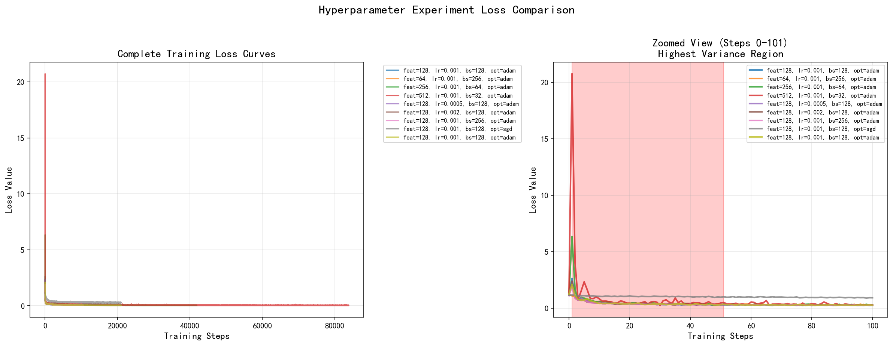
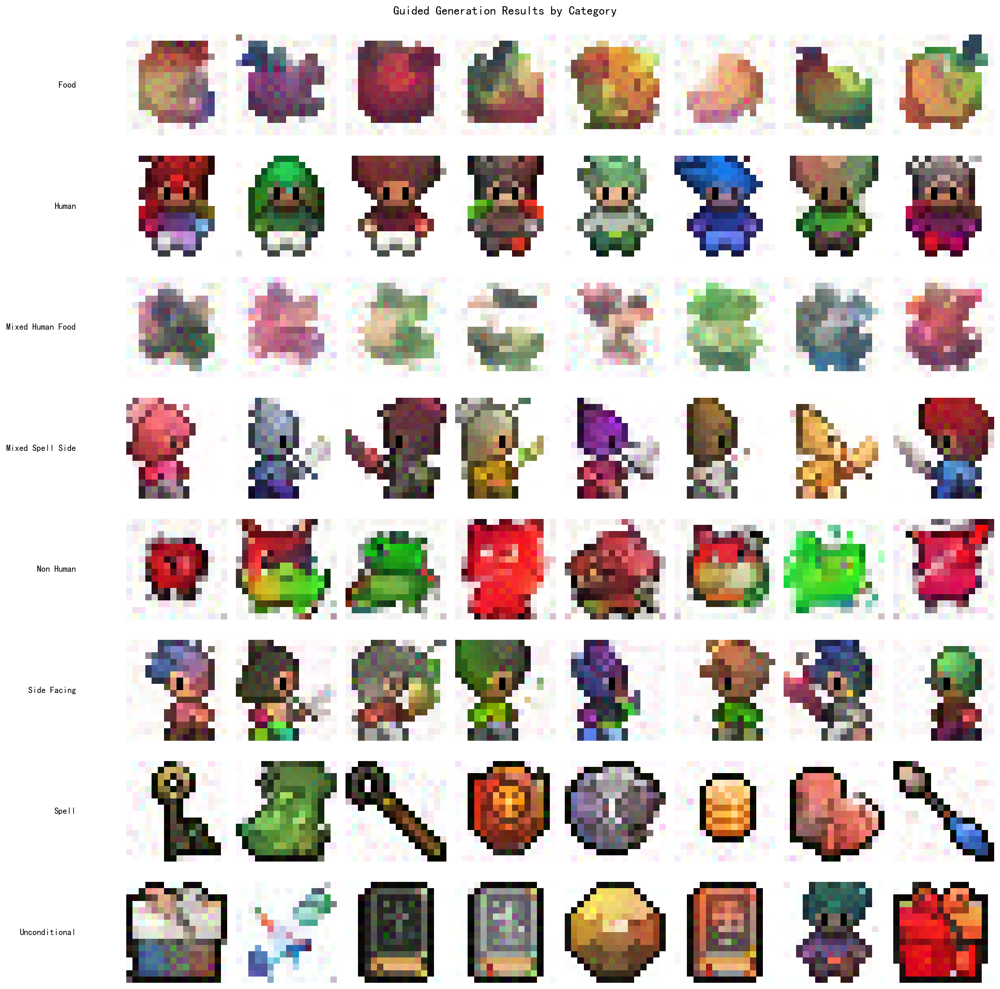

# Diffusion Models Experimentation Suite

[](https://opensource.org/licenses/MIT)
[](https://www.python.org/downloads/)
[](https://pytorch.org/)

> **Educational experimentation framework** based on [Ryota Kawamura's implementation](https://github.com/Ryota-Kawamura/How-Diffusion-Models-Work) of DeepLearning.AI's ["How Diffusion Models Work"](https://www.deeplearning.ai/short-courses/how-diffusion-models-work/) course by Sharon Zhou.

This repository provides a comprehensive **experimentation and analysis framework** for exploring diffusion models, with systematic hyperparameter tuning, sampling algorithm comparisons, and guided generation examples on 16×16 pixel sprites.

## 🎯 Project Goals

This project extends the original course materials with practical experimentation tools:

- 🧪 **9 Hyperparameter Configurations** - Systematic exploration of feature dimensions, learning rates, batch sizes, and optimizers
- ⚖️ **DDPM vs DDIM Comparison** - Performance analysis and speed benchmarking
- 🎨 **Guided Generation Suite** - Working examples across all 5 sprite categories
- 📊 **Automated Analysis** - Comprehensive reporting with visualizations and zoomed comparison views
- 📝 **Complete Documentation** - Learning resources, implementation notes, and troubleshooting guides

## ✨ What's Added to Original Course

### Core Framework
- **`experiment_design.py`** - Unified experiment management system with:
  - Hyperparameter experiment runner (9 configurations)
  - Sampling algorithm comparator (DDPM vs DDIM)
  - Guided generation orchestrator
  - Result persistence and loading

- **`experiment_analysis.py`** - Automated analysis toolkit with:
  - Markdown report generation
  - Loss curve visualization (with zoomed high-variance regions)
  - Performance comparison tables
  - Guided generation gallery creation

### Testing & Utilities
- **`test_guided_generation.py`** - Quick validation for all categories
- **`diagnose_model.py`** - Model debugging and performance analysis
- **`compare_results.py`** - Training data vs generated results comparison
- **`view_training_data.py`** - Dataset visualization by category

### Documentation
- **Experiment reports** - Auto-generated markdown summaries
- **Implementation notes** - Detailed technical explanations
- **Troubleshooting guides** - Common issues and solutions

---

## 📊 Experiment Results

### 1. Hyperparameter Exploration (9 Configurations)

| Exp | Features | Learning Rate | Batch Size | Optimizer | Final Loss | Sample Time |
|-----|----------|---------------|------------|-----------|------------|-------------|
| exp_0 | 128 | 0.001 | 128 | adam | 0.0312 | 7.49s |
| exp_1 | 64 | 0.001 | 256 | adam | 0.0797 | 5.90s |
| exp_2 | 256 | 0.001 | 64 | adam | 0.0157 | 9.36s |
| exp_3 | 512 | 0.001 | 32 | adam | 0.0421 | 26.39s |
| exp_4 | 128 | 0.0005 | 128 | adam | 0.0732 | 5.51s |
| exp_5 | 128 | 0.002 | 128 | adam | 0.0398 | 5.04s |
| exp_6 | 128 | 0.001 | 256 | adam | 0.0657 | 6.74s |
| exp_7 | 128 | 0.001 | 128 | sgd | 0.2697 | 5.81s |
| exp_8 | 128 | 0.001 | 128 | adam | 0.0346 | 2.88s |


*Left: Complete training curves | Right: Zoomed view showing convergence differences*

**Key Findings:**
- **Best configuration**: exp_2 (256 features, lr=0.001, bs=64) - Lowest final loss
- **Fastest**: exp_8 (baseline with optimizations) - 2.88s sampling time
- **Optimizer impact**: Adam significantly outperforms SGD (exp_0 vs exp_7)

### 2. DDPM vs DDIM Sampling Comparison

| Model | DDPM Time | DDIM Time | Speedup | DDPM Mean | DDIM Mean |
|-------|-----------|-----------|---------|-----------|-----------|
| baseline | 6.49s | 0.28s | **22.9x** | 0.247 | 0.263 |
| comp_mod_1 | 5.18s | 0.26s | **20.1x** | 0.297 | 0.213 |
| comp_mod_2 | 5.95s | 0.28s | **21.1x** | 0.297 | 0.248 |

**Conclusion**: DDIM achieves ~21x speedup with comparable quality

### 3. Guided Generation Results



Successfully generates distinct sprites for:
- ✅ **Human**: Characters with various hair colors and outfits
- ✅ **Food**: Apples, fruits, and food items
- ✅ **Non-Human**: Monsters, slimes, creatures
- ✅ **Spell**: Magic effects and spell visuals
- ✅ **Side-Facing**: Side-view characters
- ✅ **Mixed Categories**: Experimental combinations

---

## 🚀 Quick Start

### Installation

```bash
# Clone this repository
git clone https://github.com/[YourUsername]/Diffusion-Experiments.git
cd Diffusion-Experiments

# Install dependencies
pip install torch torchvision numpy matplotlib pandas pillow

# Verify installation
python -c "import torch; print(f'PyTorch {torch.__version__} ready!')"
```

### Run Experiments

```bash
# 1. Test guided generation for all categories
python test_guided_generation.py
# → Generates: experiment_results/samples/guided_*.png

# 2. Generate comprehensive analysis report
python experiment_analysis.py
# → Creates: experiment_results/experiment_report.md
#           experiment_results/hyperparameter_losses.png
#           experiment_results/guided_generation_comparison.png

# 3. Explore original course notebooks
jupyter notebook
# → Open L1-L4 notebooks for tutorials
```

### Basic Usage Example

```python
from experiment_design import ExperimentManager

# Initialize manager
manager = ExperimentManager()

# Example 1: Run guided generation
contexts = {
    'food_test': [0, 0, 1, 0, 0],  # Generate food sprites
    'human_test': [1, 0, 0, 0, 0],  # Generate human sprites
}

results = manager.guided_generation_experiment(
    model_path='weights/context_model_31.pth',
    context_configs=contexts
)

# Example 2: Compare DDPM vs DDIM
sampling_results = manager.sampling_comparison_experiment(
    model_path='weights/context_model_31.pth'
)
print(f"Speedup: {sampling_results['speedup']:.1f}x")
```

---

## 📁 Project Structure

```
Diffusion-Models-Experimentation-Suite/
├── Core/
│   ├── diffusion_utilities.py
│   ├── experiment_analysis.py
│   └── experiment_design.py
├── Data/
│   ├── sprite_labels_nc_1788_16x16.npy
│   └── sprites_1788_16x16.npy
├── Scripts/
│   ├── compare_results.py
│   ├── diagnose_model.py
│   ├── test_guided_generation.py
│   └── view_training_data.py
├── experiment_results/
│   ├── samples/
│   ├── guided_generation.json
│   ├── guided_generation_comparison..
│   ├── hyperparameter_losses.png
│   ├── hyperparameter_results.json
│   ├── sampling_comparison.json
│   └── sampling_time_comparison.png
├── .gitignore
├── LICENSE
└── README.md
```

---

## 🧪 Detailed Experiment Descriptions

### Experiment 1: Hyperparameter Exploration

**Goal**: Understand impact of model architecture and training hyperparameters

**Variables Tested**:
- **Feature Dimensions**: 64, 128, 256, 512
- **Learning Rates**: 0.0005, 0.001, 0.002
- **Batch Sizes**: 32, 64, 128, 256
- **Optimizers**: Adam, SGD

**Methodology**:
- 30 epochs training for each configuration
- Fixed: 500 timesteps, 16×16 sprites
- Metrics: Final loss, convergence speed, sampling time

**Code**:
```python
from experiment_design import ExperimentManager

manager = ExperimentManager()

# Define 9 configurations
configs = {
    'exp_0': {'n_feat': 128, 'lr': 0.001, 'batch_size': 128, 'optimizer': 'adam'},
    'exp_1': {'n_feat': 64,  'lr': 0.001, 'batch_size': 256, 'optimizer': 'adam'},
    'exp_2': {'n_feat': 256, 'lr': 0.001, 'batch_size': 64,  'optimizer': 'adam'},
    # ... 6 more configurations
}

# Run all experiments
results = manager.hyperparameter_experiment(configs, n_epoch=30)
```

### Experiment 2: DDPM vs DDIM

**Goal**: Quantify speed-quality tradeoff between sampling algorithms

**Setup**:
- DDPM: 500 denoising steps (standard)
- DDIM: 25 denoising steps (20x fewer)
- Generate 32 images per method
- Measure time and visual quality metrics

**Code**:
```python
results = manager.sampling_comparison_experiment(
    model_path='weights/context_model_31.pth'
)

print(f"DDPM: {results['ddpm_time']:.2f}s")
print(f"DDIM: {results['ddim_time']:.2f}s")
print(f"Speedup: {results['speedup']:.1f}x")
```

### Experiment 3: Guided Generation

**Goal**: Demonstrate conditional generation across all categories

**Categories** (5-dimensional one-hot encoding):
```python
contexts = {
    'human':      [1, 0, 0, 0, 0],  # Position 0: Human
    'non_human':  [0, 1, 0, 0, 0],  # Position 1: Non-human
    'food':       [0, 0, 1, 0, 0],  # Position 2: Food
    'spell':      [0, 0, 0, 1, 0],  # Position 3: Spell
    'side_facing':[0, 0, 0, 0, 1],  # Position 4: Side-facing
    'unconditional': [0, 0, 0, 0, 0],  # All zeros: random
    'mixed_human_food': [1, 0, 1, 0, 0],  # Multi-hot: experimental
}
```

**Code**:
```python
results = manager.guided_generation_experiment(
    'weights/context_model_31.pth',
    contexts
)

# Results: 32 images per category
# Saved to: experiment_results/samples/guided_*.png
```

---

## 📚 Learning Path

### For Beginners

1. **Start with Notebooks** (recommended order):
   - `L1_Sampling.ipynb` - Understand the sampling process
   - `L2_Training.ipynb` - Learn how to train diffusion models
   - `L3_Context.ipynb` - Explore conditional generation
   - `L4_FastSampling.ipynb` - Master DDIM acceleration

2. **Run Experiments**:
   ```bash
   python test_guided_generation.py  # See results immediately
   ```

3. **Analyze Results**:
   ```bash
   python experiment_analysis.py     # Generate full report
   cat experiment_results/experiment_report.md
   ```

### For Advanced Users

**Try Custom Experiments**:

```python
from diffusion_utilities import ContextUnet, sample_ddim
import torch

# Load model
device = "cuda" if torch.cuda.is_available() else "cpu"
model = ContextUnet(in_channels=3, n_feat=64, n_cfeat=5, height=16).to(device)
model.load_state_dict(torch.load('weights/context_model_31.pth'))
model.eval()

# Experiment: Effect of DDIM steps on quality
for n_steps in [10, 25, 50, 100]:
    context = torch.tensor([[0, 0, 1, 0, 0]] * 8, dtype=torch.float32).to(device)
    samples = sample_ddim(model, 8, (3, 16, 16), device,
                         n=n_steps, context=context, eta=0.0)
    # Save and compare results
    save_image(samples, f'food_steps_{n_steps}.png')
```

---

## 🔬 Technical Details

### Model Architecture

**ContextUnet**: U-Net with time and category conditioning

```python
Input: 16×16 RGB image (noisy)
       ↓
Encoder: Conv blocks with downsampling
       ↓ (skip connections)
Bottleneck: ResidualConvBlock
       ↓ (skip connections)
Decoder: Conv blocks with upsampling
       ↓ + Time Embedding (t)
       ↓ + Context Embedding (c)
Output: 16×16 Predicted noise
```

**Context Modulation Mechanism**:
```python
# In ContextUnet forward pass
cemb1 = self.contextembed1(c)  # [batch, 5] → [batch, 128, 1, 1]
temb1 = self.timeembed1(t)     # [batch, 1] → [batch, 128, 1, 1]

# Multiplicative conditioning in decoder
up2 = self.up1(cemb1 * up1 + temb1, down2)
```

### DDIM Formula (from L4 notebook)

```python
def denoise_ddim(x, t, t_prev, pred_noise):
    """
    DDIM denoising step

    Args:
        x: Current noisy image at timestep t
        t: Current timestep
        t_prev: Previous (less noisy) timestep
        pred_noise: Model's predicted noise
    """
    ab = ab_t[t]           # Alpha_bar at t
    ab_prev = ab_t[t_prev]  # Alpha_bar at t-1

    # Predict x_0 from x_t
    x0_pred = ab_prev.sqrt() / ab.sqrt() * (x - (1 - ab).sqrt() * pred_noise)

    # Direction pointing to x_t
    dir_xt = (1 - ab_prev).sqrt() * pred_noise

    return x0_pred + dir_xt
```

**Key Insight**: DDIM is deterministic (eta=0), allowing accelerated sampling

---

## 📖 Citation

If you find this experimentation framework useful, please cite:

```bibtex
@misc{diffusion-experiments-2025,
  author = {[Your Name]},
  title = {Diffusion Models Experimentation Suite},
  year = {2025},
  publisher = {GitHub},
  url = {https://github.com/[YourUsername]/Diffusion-Experiments},
  note = {Systematic experimentation framework for diffusion model exploration}
}
```

**Please also cite the original course and implementation**:

```bibtex
@course{zhou2024diffusion,
  author = {Sharon Zhou},
  title = {How Diffusion Models Work},
  organization = {DeepLearning.AI},
  year = {2024},
  url = {https://www.deeplearning.ai/short-courses/how-diffusion-models-work/}
}

@misc{kawamura2024diffusion,
  author = {Ryota Kawamura},
  title = {How Diffusion Models Work - Course Implementation},
  year = {2024},
  publisher = {GitHub},
  url = {https://github.com/Ryota-Kawamura/How-Diffusion-Models-Work}
}
```

---

## 📄 License

MIT License - see [LICENSE](LICENSE) file for details.

- **Course Materials** © DeepLearning.AI
- **Original Implementation** © Ryota Kawamura
- **Experimentation Framework** © [Your Name] 2025

---

## 🙏 Acknowledgments

### Educational Foundation
- **Sharon Zhou** (DeepLearning.AI) - Outstanding course design and teaching
- **Ryota Kawamura** - Clean, well-documented implementation of course materials
- **DeepLearning.AI** - Making advanced AI education accessible to everyone

### This Project's Contributions
- Systematic experimentation framework with 9 hyperparameter configurations
- Automated analysis and reporting pipeline
- Comprehensive documentation and visualization tools
- Working examples and testing utilities for all features
- Enhanced `diffusion_utilities.py` with additional helper functions

### Community
- PyTorch team for excellent deep learning framework
- Matplotlib, NumPy, Pandas maintainers
- Open-source community for inspiration and support

---

## 💡 Tips & Best Practices

### Getting Started
1. **Start small**: Run `test_guided_generation.py` first (~2 minutes)
2. **Read notebooks**: Go through L1-L4 to understand concepts
3. **Experiment**: Try modifying hyperparameters and observe effects
4. **Analyze**: Use automated tools to compare results

### Debugging Guide

**Issue**: Generated images are noisy/unclear
```python
# Solution 1: Increase DDIM steps
samples = sample_ddim(..., n=50)  # Try 50 instead of 25

# Solution 2: Check model loading
model.load_state_dict(torch.load(path, map_location=device))
```

**Issue**: Out of memory
```python
# Solution: Reduce batch size
samples = sample_ddim(model, 16, ...)  # Try 16 instead of 32
```

**Issue**: Slow generation
```python
# Solution: Use DDIM instead of DDPM
# DDIM is 20x faster with comparable quality
samples = sample_ddim(...)  # Not sample_ddpm(...)
```

### Experiment Ideas

1. **Test more DDIM steps**: `[10, 25, 50, 100, 200]`
2. **Try mixed categories**: `[1, 0, 1, 0, 0]` (human + food)
3. **Compare optimizers**: Adam vs AdamW vs SGD
4. **Test learning rate schedules**: Cosine annealing
5. **Vary batch sizes**: Impact on convergence

---

## 📬 Contact & Support

**Questions or Issues?**
- Open an issue: [GitHub Issues](https://github.com/leeoisaboy/Diffusion-Models-Experimentation-Suite/issues)
- Email: 13850666310@163.com
- Pull requests welcome!

**Found a bug?** Please report with:
- Description of the issue
- Steps to reproduce
- System information (OS, Python version, PyTorch version)

---

## 🌟 Star History

If you find this project helpful, please consider giving it a star! ⭐

It helps others discover this resource and motivates continued development.

---

<div align="center">

**Happy Experimenting! 🚀**

*Built for learning and exploring diffusion models*

*Systematic experimentation · Comprehensive analysis · Educational focus*

[⬆ Back to Top](#diffusion-models-experimentation-suite)

</div>
